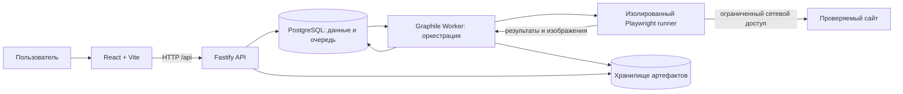

# Архитектура ReleaseCheck

Статус: выбранное направление для MVP, реализация ещё не начата.
Дата: 24 сентября 2026 года. Подробные компромиссы — в [decisions.md](decisions.md).

## Состав системы

Один TypeScript monorepo с тремя запускаемыми приложениями. API и worker
разделены по процессам, но имеют общую модель данных и цикл выпуска.



### Web

React + Vite + TypeScript. Серверное состояние — TanStack Query; маршруты —
React Router. Опрос активного запуска раз в 2 секунды, прекращается после
терминального состояния или при скрытой вкладке. WebSocket/SSE пока не нужны.
Web знает только публичные контракты API, не импортирует SQL, worker или секреты.

### API

Fastify: проверка входных данных, авторизация владельца, управление проектами,
создание запусков, чтение отчётов, подтверждение эталонов и доступ к артефактам.
Контракты описываются runtime-схемами Zod; OpenAPI генерируется из тех же схем.
Долгие браузерные операции не выполняются внутри HTTP-запроса.

### Worker и runner

Graphile Worker хранит очередь в PostgreSQL. Payload содержит `runId`, а
конфигурация читается из неизменяемого снимка запуска в БД.
Один job обрабатывает один запуск, начиная с concurrency=1. Внутри запуска
страницы и viewport обрабатываются последовательно; готовые результаты
сохраняются по мере выполнения. Масштабирование измеряем позже.

Runner принимает ограниченную конфигурацию проверки, запускает Chromium и
возвращает структурированные наблюдения и файлы. Он не получает credentials
БД/хранилища. Worker сохраняет результаты. В локальном прототипе runner может
быть дочерним процессом; перед проверкой внешних сайтов нужна изоляция контейнера
и сети. BrowserContext обеспечивает чистую сессию, но не является границей безопасности.

### Данные и артефакты

PostgreSQL: доменные таблицы, миграции и очередь. Доступ к доменным таблицам —
Drizzle; функции очереди вызываются через поддерживаемый Graphile API/SQL.
Изображения не храним в PostgreSQL. Storage adapter: локальная директория для
разработки, приватное S3-совместимое хранилище для деплоя. Доступ к изображениям
через авторизованный API или короткоживущие signed URL после проверки владельца.

## Будущая структура репозитория

```text
apps/
  web/                 React, маршруты, UI и клиент API
  api/                 HTTP, сессии, авторизация и use cases
  worker/              очередь, повторы, runner и сохранение результатов
packages/
  contracts/           Zod-схемы запросов/ответов и публичные типы
  db/                  схема PostgreSQL, миграции и запросы
  checks/              сбор наблюдений и сравнение, без HTTP API и БД
  storage/             локальная и S3 реализации хранения
fixtures/
  demo-site/           детерминированный сайт с управляемыми регрессиями
docs/
```

Это план, а не уже созданные приложения. Пакет появляется вместе с первым
реальным потребителем. Используем npm workspaces и единый lockfile; отдельный
оркестратор monorepo пока не нужен. Направление зависимостей: apps → packages;
contracts не зависит от БД, checks не зависит от web или API.

## Основные сущности

| Сущность | Основные данные и инварианты |
| --- | --- |
| User / Session | Владелец и серверная сессия; cookie HttpOnly, Secure в production |
| Project | ownerId, name, разрешённый origin; доступ всегда проверяется по ownerId |
| Page | projectId, path, порядок; максимум 5 активных страниц |
| Run | projectId, status, verdict, configSnapshot, idempotencyKey, timestamps |
| PageResult | runId, pageKey, viewport, attempt, status, baselineArtifactId, captureProfileHash |
| Finding | pageResultId, kind, severity, fingerprint, детали, источник |
| Artifact | projectId, pageResultId, kind, storageKey, checksum, bytes |
| Baseline | projectId, pageKey, viewport, captureProfileHash, artifactId, version, approvedBy |

Уникальность PageResult: `(runId, pageKey, viewport)`. Уникальность эталона:
`(projectId, pageKey, viewport, captureProfileHash)`. Профиль включает версию
Chromium, ОС runner, размеры, scale factor, locale, timezone, маски и настройки
захвата. Несовместимые профили не сравниваем.

Запуск сохраняет список страниц, настройки и выбранные baselineArtifactId на
момент создания. Редактирование проекта или принятие нового эталона не меняет
старые отчёты. Изображения, используемые эталоном, не удаляются очисткой истории.

## Жизненный цикл

`queued → running → completed | partial | failed`.

- `completed`: все запланированные проверки обработаны, даже если найдены ошибки сайта.
- `partial`: часть проверок не завершена; доступные результаты сохранены.
- `failed`: не получено ни одного полного результата или произошёл системный сбой.
- Verdict отдельно: `pass | attention | inconclusive`.
- Незавершённый запуск никогда не получает `pass`. Отсутствие эталона означает
  неполную визуальную проверку (`inconclusive`), а не отсутствие изменений.
- `completed + attention` — корректно исполненная проверка, обнаружившая проблему.

1. API проверяет доступ, лимиты и конфигурацию. Создание Run и постановка job
   выполняются в одной транзакции PostgreSQL.
2. Повторный POST с тем же idempotency key и телом возвращает тот же Run;
   с другим телом — 409. Ключ ограничен владельцем и проектом.
3. Worker захватывает job, увеличивает номер попытки и отмечает heartbeat.
4. Для каждого viewport создаётся чистый BrowserContext. Подписки на ошибки и
   HTTP-ответы устанавливаются до перехода на страницу.
5. Навигация ждёт DOMContentLoaded, затем fonts/готовность страницы в пределах
   общего тайм-аута. Анимации отключены, locale/timezone фиксированы. Бесконечного
   ожидания networkidle нет. Нестабильный захват помечается в отчёте.
6. Runner возвращает скриншот, ошибки и bounded-проверку ссылок. Worker загружает
   файлы под ключом попытки, затем атомарно сохраняет manifest и PageResult.
7. Завершение вычисляется по ожидаемым PageResult, а не по наличию любого скриншота.
8. Только транспортные/инфраструктурные сбои job допускают до 2 повторов с задержкой.
   Ошибка сайта или visual diff не запускают повтор всей проверки.

Очередь гарантирует at-least-once, поэтому обработчик идемпотентен. Финализация
результатов проверяет актуальный номер попытки: старый worker не может перезаписать
новую попытку. При падении процесса lease/heartbeat позволяют восстановить job;
периодическая сверка отмечает исчерпавшие повторы Run как failed/partial.
Сиротские файлы удаляются отдельной очисткой, не в транзакции БД.

## Эталон и visual diff

Первый запуск предоставляет кандидат в эталон. Подтверждение — явный POST
владельца, с ожидаемой версией baseline для защиты от одновременных изменений.
Допускается только завершённый захват из того же проекта и совместимого профиля.
Сохраняем автора, время и ссылку на исходный результат.

Сравнение PNG — pixelmatch; отчёт содержит diff image, долю отличающихся пикселей,
порог и настройки. Несовпадение размеров — отдельное finding, не растягиваем
изображения ради сравнения. Скрытие динамических областей задаётся явными масками.
Для повторяемости эталон и текущий снимок снимаются в одинаковом Linux-окружении.

## HTTP API первой версии

| Метод и путь | Назначение |
| --- | --- |
| GET /api/health | Проверка процесса; readiness БД будет отдельной |
| POST /api/projects | Создать проект с origin и страницами |
| GET /api/projects | Проекты текущего пользователя |
| GET /api/projects/:id | Конфигурация проекта |
| PATCH /api/projects/:id | Изменить будущую конфигурацию |
| POST /api/projects/:id/runs | Поставить запуск в очередь, 202 + runId; Idempotency-Key |
| GET /api/projects/:id/runs | История с cursor pagination |
| GET /api/runs/:id | Статус, прогресс и результаты |
| POST /api/projects/:id/baselines | Подтвердить конкретные pageResultId и версии |
| GET /api/artifacts/:id | Авторизованная выдача файла/ссылки |

Все ID непрозрачные. Несуществующие и чужие ресурсы возвращают 404. Ошибки имеют
единый формат `{ code, message, requestId, details? }`, без внутренних stack trace.
Аутентификация — одна OAuth-интеграция GitHub и серверные сессии перед внешней
бета-версией; отдельный локальный dev-user разрешён только в development.
Cookie-auth требует same-origin, CSRF-защиты для mutations и проверки Origin.

## Ограничения исполнения и публикации

Стартовые лимиты, подлежащие измерению: 1 активный запуск на проект, 10 captures
на запуск, 30 секунд на навигацию, 60 секунд на page/viewport и 12 минут на Run.
Для ссылок — concurrency=2, 5 секунд на запрос, не более 3 redirect и 20 URL на
страницу. GET без исполнения JS, только same-origin HTTP(S), без fragment,
с ограничением получаемого тела и без посещения внешних redirect.

Проверка URL сама по себе не защищает от SSRF. До работы с пользовательскими
адресами runner должен иметь сетевую политику: блокировать private, loopback,
link-local, metadata и служебные сети, IPv4/IPv6; проверять назначения redirect
и subresource; учитывать DNS rebinding. Запрет обеспечивается на уровне egress,
а не только строковой валидацией. Runner работает без root и без отключения
Chromium sandbox, с лимитами CPU/RAM и времени. API/БД не доступны из его сети.

До готовности этой границы публичное демо показывает сохранённые результаты
или запускает только контролируемый fixture; произвольный URL не принимается.
Локальное исключение для fixture явно ограничено development и не переносится
в production. Это часть устройства сервиса, который открывает сайты на сервере.

## Эксплуатация и проверки

- Деплой: статический web и API под одним origin, отдельный worker/runner,
  PostgreSQL и приватное хранилище. Провайдер и платные ресурсы ещё не выбраны.
- Структурированные логи: requestId, runId, pageResultId, attempt; без cookies,
  токенов, тел запросов и чувствительных query parameters.
- Лимиты хранения и очистка: по умолчанию история 30 дней; активные эталоны сохраняются.
- Unit: verdict, нормализация URL, ключи сравнения, идемпотентность решений.
- Integration: настоящая PostgreSQL, атомарная очередь, повтор job, смена baseline,
  изоляция владельцев и восстановление после падения worker.
- E2E: controlled fixture, эталон → внедрение регрессии → finding → подтверждение.
- CI: typecheck, lint, unit/integration, build; E2E после появления сквозного пути.

## Источники решений

- [Vite: требования и начало работы](https://vite.dev/guide/).
- [Graphile Worker: очередь на PostgreSQL и at-least-once](https://worker.graphile.org/docs).
- [Playwright: контейнеры и ограничения при посещении внешних сайтов](https://playwright.dev/docs/docker).
